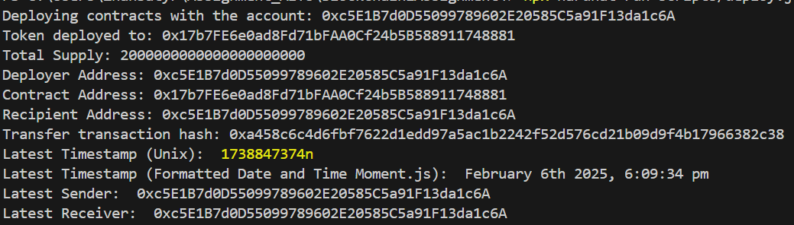

# BlockchainTechologies_3_Assignment

# README: AITU_SE_2317 ERC-20 Token

## Project Title
**AITU_SE_2317 ERC-20 Token**

## Overview
This project implements a custom ERC-20 token named `AITU_SE_2317`. It features enhanced transaction tracking by recording details of each transfer and providing utility functions to retrieve transaction information. The contract leverages OpenZeppelin's ERC-20 implementation for security and standardization.

---

## Features
### Standard ERC-20 Token
- **Token Name**: Defined during deployment.
- **Token Symbol**: Defined during deployment.
- **Initial Supply**: Specified during deployment.

### Custom Functionalities
1. **Transaction Logging**
   - Records sender, receiver, amount, and timestamp for each transfer.
   - Emits a `TransactionLogged` event upon successful transfer.

2. **Utility Functions**
   - `getLatestTransactionTimestamp()`: Returns the timestamp of the latest transaction.
   - `getLatestTransactionSender()`: Retrieves the sender address of the latest transaction.
   - `getLatestTransactionReceiver()`: Retrieves the receiver address of the latest transaction.
   - `getLatestTransactionDetails()`: Returns a tuple containing all details of the latest transaction.

---

## Setup and Deployment

### Prerequisites
1. **Node.js** and **npm**
   - Install Node.js: [Download here](https://nodejs.org/)
   - Install npm (comes with Node.js).
2. **Truffle Suite** or **Hardhat**
   - Truffle: `npm install -g truffle`
   - Hardhat: `npm install --save-dev hardhat`
3. **MetaMask Wallet**
   - Install MetaMask as a browser extension.
4. **OpenZeppelin Contracts**
   - Install OpenZeppelin: `npm install @openzeppelin/contracts`

### Deployment
1. Clone the repository:
   ```bash
   git clone <repository_url>
   cd <repository_name>
   ```
2. Install dependencies:
   ```bash
   npm install
   ```
3. Compile the smart contract:
   ```bash
   npx hardhat compile
   ```
4. Deploy to a testnet (e.g., Goerli or Sepolia):
   ```bash
   npx hardhat run scripts/deploy.js --network goerli
   ```

### Interacting with the Token
- Use tools like **Ethers.js** or **Web3.js** to call the contract's methods.
- Alternatively, interact with the contract via a blockchain explorer or MetaMask.

---


### Example Usage
#### Transfer Tokens
```solidity
function transfer(address recipient, uint256 amount) public override returns (bool);
```
#### Retrieve Latest Transaction Details
```solidity
function getLatestTransactionDetails()
    public
    view
    returns (address sender, address receiver, uint256 amount, uint256 timestamp);
```


### Screenshots




### Members

Moldabek Zhanbatyr SE-2317

Shugay Nadir SE-2317

Pavel Kan SE-2317


